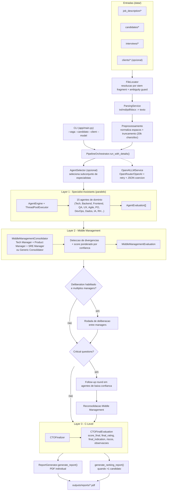

# Board de Arquitetura do Sistema

## 1) Visao Geral

Este board descreve a arquitetura completa do sistema EntrevistaTaking: entradas, orquestracao multiagente, consolidacao gerencial, decisao C-Level e geracao de relatorios.

## 2) Camadas e Responsabilidades

| Camada | Modulos principais | Responsabilidade |
|---|---|---|
| Interface | `app/main.py` | Parse de argumentos CLI, resolucao de candidatos, bootstrap do pipeline |
| Ingestao | `app/utils/file_locator.py`, `app/services/parsing_service.py` | Descobrir arquivos de entrada e extrair texto de txt/md/pdf/docx |
| Orquestracao | `app/pipeline/orchestrator.py` | Coordenar passos 1..8, ativar selecao dinamica, deliberacao e follow-up |
| Especialistas (L1) | `app/core/domain_rules/agent_registry.py`, `app/core/orchestration/agent_engine.py` | Executar agentes em paralelo e produzir `AgentEvaluation[]` |
| Gestao media (L2) | `app/core/orchestration/middle_and_c_level.py` | Consolidar visoes, detectar divergencias, gerar perguntas criticas |
| C-Level (L3) | `CTOFinalizer` no mesmo modulo | Tomar decisao final e normalizar rating/indicacao |
| Infra LLM | `app/services/llm_service.py` | Chamada ao provedor LLM, retries, validacao/extração JSON |
| Saida | `app/services/report_generator.py` | Gera PDF individual e PDF de ranking consolidado |

## 3) Sequencia Operacional (pipeline real)

1. Carrega arquivos de vaga, CV candidato, entrevista e (opcional) cliente.  
2. Faz preprocessamento de texto (normalizacao e truncamento seguro).  
3. Seleciona dinamicamente agentes relevantes para a vaga (quando habilitado).  
4. Executa os especialistas em paralelo e coleta avaliacoes estruturadas.  
5. Consolida em middle management (1 ou 3 managers, com peso por confianca).  
5b. (Opcional) Deliberacao entre managers para calibrar divergencias.  
6. (Opcional) Follow-up round para questoes criticas em agentes de baixa confianca.  
7. Executa avaliacao C-Level para decisao final.  
8. Gera relatorio PDF individual e, se houver multiplos candidatos, ranking consolidado.

## 4) Contratos de Dados (Pydantic)

- `DocumentSet`: pacote de contexto textual normalizado.
- `AgentDefinition`: metadados do agente (dominio, prompt, contexto permitido).
- `AgentEvaluation`: score, confianca, pontos fortes, gaps, riscos e recomendacao.
- `MiddleManagementEvaluation`: score consolidado, conflitos, questoes criticas, divergencias e analise.
- `CTOFinalEvaluation`: rating final, score final, indicacao, riscos e observacoes.

## 5) Regras Arquiteturais Importantes

- **Resiliencia LLM**: retry exponencial para erro de conexao/rate limit.
- **Saida estruturada**: resposta esperada em JSON, com coercao para formatos legados.
- **Ambiguidade de arquivos**: mais de um match por fragmento gera erro explicito.
- **Execucao paralela**: layer 1 usa `ThreadPoolExecutor` para throughput.
- **Calibracao por confianca**: consolidacoes usam media ponderada por confianca.
- **Evolucao controlada**: feature flags no orquestrador (`agent_selection`, `follow_up_round`, `deliberation`).

## 6) Pontos de Extensao

- Adicionar novos agentes no `AgentRegistry` e prompts correspondentes.
- Customizar criterios do `AgentSelector` (prompt/meta-selecao).
- Trocar estrategia de consolidacao no `MiddleManagementConsolidator`.
- Integrar observabilidade (tracing/metrics) ao redor do `PipelineOrchestrator`.
- Evoluir `ReportGenerator` para formatos HTML/JSON alem de PDF.
